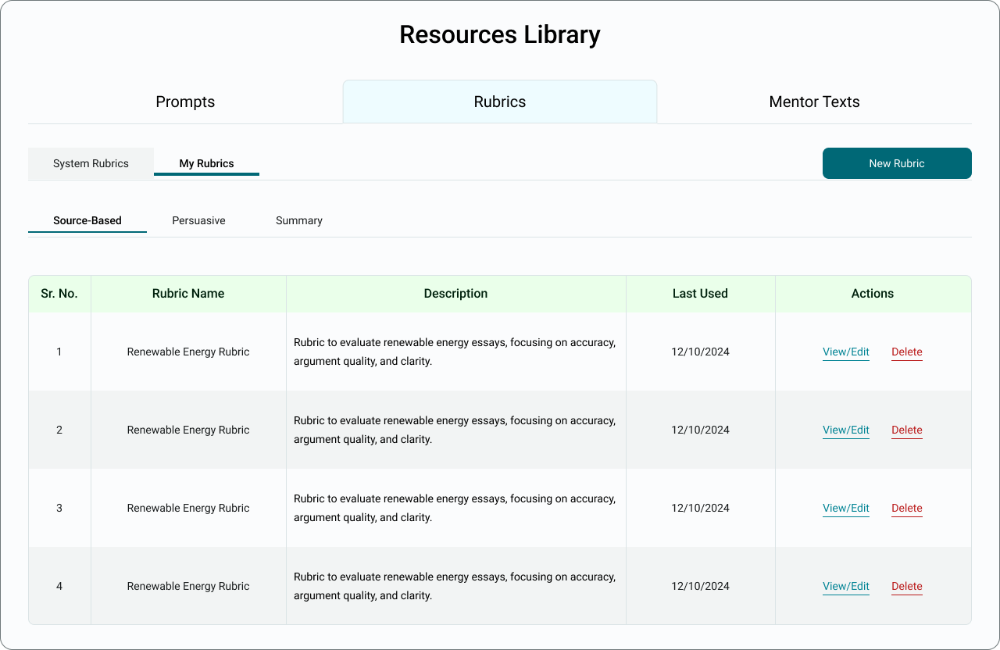

# Writing Analytics Tool (WAT) Resources

A full-stack web application for managing Writing Analytics Tool (WAT) resources.  
Frontend is built with **Angular + Bootstrap** and backend with **Django REST Framework + PostgreSQL**.

## Design Prototype

The initial design for the application was created in Figma:  

---

## Features
- Single-page Angular frontend with Bootstrap styling.
- CRUD operations for Mentor Texts.
- Django REST APIs for Metrics, Prompts, Mentor Texts, Rubrics, and Skills.
- PostgreSQL database integration.

---

## Tech Stack
- **Frontend:** Angular, Bootstrap
- **Backend:** Django, Django REST Framework
- **Database:** PostgreSQL
